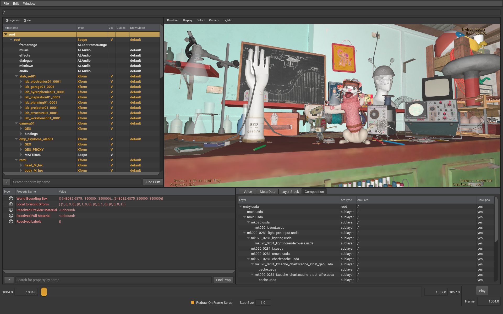
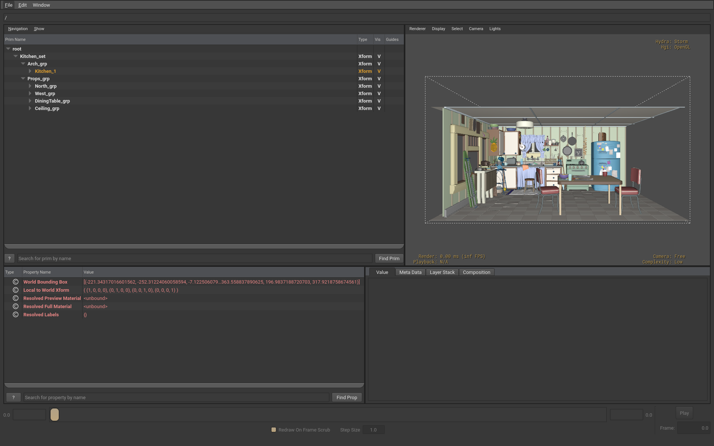

Title: Building OpenUSD on Debian
Description: A step-by-step how-to guide to build USD on Debian
og_image: usdview-debian-alab.png



[OpenUSD](https://openusd.org) is [officially tested](https://github.com/PixarAnimationStudios/OpenUSD/blob/release/VERSIONS.md) on [AlmaLinux](https://almalinux.org), with non-system dependencies [built from a custom script](https://github.com/PixarAnimationStudios/OpenUSD/blob/release/build_scripts/build_usd.py). This makes it non-trivial for [Debian](https://debian.org) users to build and run USD against system packages.

This guide summarizes a way of building [OpenUSD v25.08](https://github.com/PixarAnimationStudios/OpenUSD/tree/v25.08) on [Debian 13 trixie](https://www.debian.org/releases/trixie/). We'll build the USD C++ libraries, Python modules, [tools](https://openusd.org/release/toolset.html) (including [usdview](https://openusd.org/release/toolset.html#usdview)) and code [examples](https://github.com/PixarAnimationStudios/OpenUSD/tree/dev/extras/usd/examples) (including the [OBJ file format plugin](https://github.com/PixarAnimationStudios/OpenUSD/tree/dev/extras/usd/examples/usdObj)). Tests and documentation won't be built. Some USD dependencies are not packaged for Debian like [PTex](https://ptex.us/), [MaterialX](https://materialx.org) or [Alembic](https://www.alembic.io). As such, the matching USD plugins will be left out for now.

Our final USD build will include:

- core libraries and their [Python](https://www.python.org) wrappers
- [OpenExec](https://openusd.org/release/intro_to_openexec.html)
- command line tools and usdview
- [Draco](https://google.github.io/draco/), [OpenColorIO](https://opencolorio.org/), [OpenImageIO](https://openimageio.readthedocs.io/en/v3.0.9.0/) and [OpenVDB](https://www.openvdb.org/) plugins
- the code examples

These parts won't be built:

- [Embree](https://www.embree.org/), PTex, Alembic and MaterialX plugins
- tests
- documentation

The final file layout will look like:

- `~/opt/OpenUSD-v25.08` is the final installation folder
- `~/opt/OpenUSD-v25.08.environment` is a sourceable script to set up the necessary environment variables to run the USD tools
- `~/tmp/OpenUSD` for the source code
- `~/tmp/build-OpenUSD` for the temporary build files

Is something not explained well enough ? Is there an ambiguity somewhere ? Am I grammatically challenged in English ? Please [drop me a message](mailto:charles.fleche@free.fr) or even better, submit a [pull request](https://github.com/charlesfleche/charlesfleche.net/edit/master/content/article/2025-08-30-building-usd-on-debian/en.md). 

# Why not running the OpenUSD's build script ?

OpenUSD is usually built from a [python script](https://github.com/PixarAnimationStudios/OpenUSD/blob/dev/build_scripts/build_usd.py) that takes care of downloading and compiling the required dependencies. At the time of writing this guide, although building OpenUSD is fine with it, it then fails at runtime because of invalid TBB binary symbols. I assume that there is a confusion somewhere between system's TBB and build time TBB. We'll make sure that the problem does not happen by having a single TBB: the Debian's one.

# Install system dependencies

First, we need to install some packages:

- [Git](https://git-scm.com/) to fetch the USD source code
- [CMake](https://cmake.org/), [make](https://www.gnu.org/software/make/) and [g++](https://gcc.gnu.org/) to compile USD
- the development packages "\*-dev" of the dependencies
- the Python packages needed during build ([python3-jinja2 ](https://jinja.palletsprojects.com/) or at runtime
- the [Qt User Interface Compiler (uic)](https://doc.qt.io/qt-6/uic.html) provided by [qt6-base-dev-tools](https://packages.debian.org/unstable/qt6-base-dev-tools)


```bash
sudo apt update
sudo apt install \
  cmake \
  g++ \
  libboost-dev \
  libdraco-dev \
  libgl-dev \
  libosd-dev \
  libopencolorio-dev \
  libopenimageio-dev \
  libopenvdb-dev \
  libtbb-dev \
  make \
  python3-dev \
  python3-jinja2 \
  python3-opengl \
  python3-pyside6.qtopenglwidgets \
  qt6-base-dev-tools
```

# Working around an OpenSubdiv packaging bug

[OpenSubdiv](https://github.com/PixarAnimationStudios/OpenSubdiv/), Pixar's mesh subdivision surface library, is installed by [libosd-dev](https://packages.debian.org/trixie/libosd-dev). The package ships the [shared libraries](https://en.wikipedia.org/wiki/Shared_library) [libosdCPU.so and libosdGPU.so](https://packages.debian.org/trixie/amd64/libosd-dev/filelist) only, and not the static versions "libosdCPU.a" and "libosdGPU.a". This in turns confuses cmake, which expects both files to be present on the filesystem or it'll fail while searching for OpenSubdiv.

We are going to trick cmake by creating empty files at the expected static library paths. This will be good enough to build USD for now, [until the debian package is fixed](https://bugs.debian.org/cgi-bin/bugreport.cgi?bug=1112551).

```bash
sudo touch \
  /usr/lib/x86_64-linux-gnu/libosdCPU.a \
  /usr/lib/x86_64-linux-gnu/libosdGPU.a
```

# Fetch OpenUSD's source code

The public version of OpenUSD ([Pixar](https://www.pixar.com/) keeps a version internally) is developped on [GitHub](https://github.com/PixarAnimationStudios/OpenUSD). We'll clone it locally and get the version we want to build.

```bash
# First, we ensure our build and install folders exist

mkdir -p ~/opt ~/tmp

# Then we make a local clone of the source code
# and checkout USD version v25.08

cd ~/tmp
git clone https://github.com/PixarAnimationStudios/OpenUSD.git
cd OpenUSD
git checkout v25.08
```

# Patch USD to build with `uic`

USD expects [pyside6-uic](https://doc.qt.io/qtforpython-6/tools/pyside-uic.html), but it doesn't exist on Debian. Instead, Qt user interface code is generated with `uic -g python`. I've made a [GitHub Pull Request](https://github.com/PixarAnimationStudios/OpenUSD/pull/3541) to build with `uic` directly. Until it's accepted, we'll download and apply the patch manually.

```bash
wcurl https://github.com/PixarAnimationStudios/OpenUSD/pull/3541.patch
git apply 3541.patch
```

# Building and installing USD

Everything should now be in order to build and install OpenUSD. We're going to make a temporary build folder, configure the build system with cmake, then build and install USD. The source code is rather large, so it's going to take a little while. On my 12 cores Xeon E5-1650, it takes around half an hour. 

```bash
# Move to the temporary build folder

cd ~/tmp
mkdir build-OpenUSD
cd build-OpenUSD

# Configure and build OpenUSD

cmake ../OpenUSD/ \
  -DPYSIDE_BIN_DIR=/usr/lib/qt6/libexec \      # Tells where uic is located
  -DPXR_BUILD_DRACO_PLUGIN=ON \
  -DPXR_BUILD_OPENIMAGEIO_PLUGIN=ON \
  -DPXR_BUILD_OPENCOLORIO_PLUGIN=ON \
  -DPXR_ENABLE_OPENVDB_SUPPORT=ON \
  -DPXR_BUILD_TESTS=FALSE \                    # No test, faster build
  -DPXR_BUILD_DOCUMENTATION=OFF \              # No doc, less dependencies
  -DCMAKE_INSTALL_PREFIX=~/opt/OpenUSD-v25.08  # Sets the install location

# Build USD
# --parallel `nproc` ensures all CPU cores are used, for faster builds.
# `nproc` returns the number of cores of the system.

cmake --build . --parallel `nproc`

# Install USD to `~/opt/OpenUSD-v25.08

cmake --install .
```

At that point our USD is built and installed. Its installation folder content should look like:

```bash
tree -d ~/opt/OpenUSD-v25.08

/home/charles/opt/OpenUSD-v25.08/
├── bin
├── cmake
├── include
│   └── pxr
│       ├── base
│       │   ├── arch
│       │   ├── gf
│       │   ├── js
│       │   ├── pegtl
│       │   │   └── pegtl
│       │   │       ├── contrib
│       │   │       │   ├── icu
│       │   │       │   └── internal
│       │   │       └── internal
│       │   ├── plug
│       │   ├── tf
│       │   │   ├── pxrCLI11
│       │   │   └── pxrTslRobinMap
│       │   ├── trace
│       │   ├── ts
│       │   ├── vt
│       │   └── work
│       │       └── workTBB
│       ├── exec
│       │   ├── ef
│       │   ├── esf
│       │   ├── esfUsd
│       │   ├── exec
│       │   ├── execGeom
│       │   ├── execUsd
│       │   └── vdf
│       ├── external
│       │   └── boost
│       │       └── python
│       │           ├── converter
│       │           ├── detail
│       │           │   └── mpl2
│       │           ├── object
│       │           └── suite
│       │               └── indexing
│       │                   └── detail
│       ├── imaging
│       │   ├── cameraUtil
│       │   ├── garch
│       │   ├── geomUtil
│       │   ├── glf
│       │   ├── hd
│       │   ├── hdar
│       │   ├── hdGp
│       │   ├── hdsi
│       │   ├── hdSt
│       │   ├── hdStorm
│       │   ├── hdx
│       │   ├── hf
│       │   ├── hgi
│       │   ├── hgiGL
│       │   ├── hgiInterop
│       │   ├── hio
│       │   ├── hioOpenVDB
│       │   └── pxOsd
│       ├── usd
│       │   ├── ar
│       │   ├── kind
│       │   ├── pcp
│       │   ├── sdf
│       │   ├── sdr
│       │   ├── usd
│       │   ├── usdGeom
│       │   ├── usdHydra
│       │   ├── usdLux
│       │   ├── usdMedia
│       │   ├── usdPhysics
│       │   ├── usdProc
│       │   ├── usdRender
│       │   ├── usdRi
│       │   ├── usdSemantics
│       │   ├── usdShade
│       │   ├── usdSkel
│       │   ├── usdUI
│       │   ├── usdUtils
│       │   └── usdVol
│       ├── usdImaging
│       │   ├── usdAppUtils
│       │   ├── usdImaging
│       │   ├── usdImagingGL
│       │   ├── usdProcImaging
│       │   ├── usdRiPxrImaging
│       │   ├── usdSkelImaging
│       │   ├── usdviewq
│       │   └── usdVolImaging
│       └── usdValidation
│           ├── usdGeomValidators
│           ├── usdPhysicsValidators
│           ├── usdShadeValidators
│           ├── usdSkelValidators
│           ├── usdUtilsValidators
│           └── usdValidation
├── lib
│   ├── python
│   │   └── pxr
│   │       ├── Ar
│   │       │   └── __pycache__
│   │       ├── CameraUtil
│   │       │   └── __pycache__
│   │       ├── GeomUtil
│   │       │   └── __pycache__
│   │       ├── Gf
│   │       │   └── __pycache__
│   │       ├── Glf
│   │       │   └── __pycache__
│   │       ├── Kind
│   │       │   └── __pycache__
│   │       ├── Pcp
│   │       │   └── __pycache__
│   │       ├── Performance
│   │       │   └── ExplicitMetrics
│   │       ├── Plug
│   │       │   └── __pycache__
│   │       ├── PxOsd
│   │       │   └── __pycache__
│   │       ├── __pycache__
│   │       ├── Sdf
│   │       │   └── __pycache__
│   │       ├── Sdr
│   │       │   └── __pycache__
│   │       ├── SdrGlslfx
│   │       ├── Tf
│   │       │   ├── __pycache__
│   │       │   └── testenv
│   │       ├── Trace
│   │       │   └── __pycache__
│   │       ├── Ts
│   │       │   └── __pycache__
│   │       ├── Usd
│   │       │   └── __pycache__
│   │       ├── UsdAppUtils
│   │       │   └── __pycache__
│   │       ├── UsdDraco
│   │       ├── UsdGeom
│   │       │   └── __pycache__
│   │       ├── UsdHydra
│   │       ├── UsdImagingGL
│   │       │   └── __pycache__
│   │       ├── UsdLux
│   │       │   └── __pycache__
│   │       ├── UsdMedia
│   │       ├── UsdPhysics
│   │       ├── UsdProc
│   │       ├── UsdRender
│   │       │   └── __pycache__
│   │       ├── UsdResolverExample
│   │       ├── UsdRi
│   │       ├── UsdSchemaExamples
│   │       ├── UsdSemantics
│   │       │   └── __pycache__
│   │       ├── UsdShade
│   │       │   └── __pycache__
│   │       ├── UsdShaders
│   │       ├── UsdSkel
│   │       ├── UsdUI
│   │       ├── UsdUtils
│   │       │   └── __pycache__
│   │       ├── UsdValidation
│   │       ├── Usdviewq
│   │       │   ├── fonts
│   │       │   │   ├── Roboto
│   │       │   │   └── Roboto_Mono
│   │       │   ├── icons
│   │       │   └── __pycache__
│   │       ├── UsdVol
│   │       │   └── __pycache__
│   │       ├── Vt
│   │       │   └── __pycache__
│   │       └── Work
│   │           └── __pycache__
│   └── usd
│       ├── ar
│       │   └── resources
│       ├── esf
│       │   └── resources
│       ├── esfUsd
│       │   └── resources
│       ├── exec
│       │   └── resources
│       ├── execGeom
│       │   └── resources
│       ├── execUsd
│       │   └── resources
│       ├── glf
│       │   └── resources
│       │       └── shaders
│       ├── hd
│       │   └── resources
│       │       └── codegenTemplates
│       ├── hdGp
│       │   └── resources
│       ├── hdsi
│       │   └── resources
│       ├── hdSt
│       │   └── resources
│       │       ├── shaders
│       │       └── textures
│       ├── hdx
│       │   └── resources
│       │       ├── shaders
│       │       └── textures
│       ├── hgiGL
│       │   └── resources
│       ├── hio
│       │   └── resources
│       ├── hioOpenVDB
│       │   └── resources
│       ├── sdf
│       │   └── resources
│       ├── sdr
│       │   └── resources
│       ├── usd
│       │   └── resources
│       │       ├── codegenTemplates
│       │       └── usd
│       ├── usdGeom
│       │   └── resources
│       │       └── usdGeom
│       ├── usdGeomValidators
│       │   └── resources
│       ├── usdHydra
│       │   └── resources
│       │       ├── shaders
│       │       └── usdHydra
│       ├── usdImaging
│       │   └── resources
│       ├── usdImagingGL
│       │   └── resources
│       ├── usdLux
│       │   └── resources
│       │       └── usdLux
│       ├── usdMedia
│       │   └── resources
│       │       └── usdMedia
│       ├── usdPhysics
│       │   └── resources
│       │       └── usdPhysics
│       ├── usdPhysicsValidators
│       │   └── resources
│       ├── usdProc
│       │   └── resources
│       │       └── usdProc
│       ├── usdProcImaging
│       │   └── resources
│       ├── usdRender
│       │   └── resources
│       │       └── usdRender
│       ├── usdRi
│       │   └── resources
│       │       └── usdRi
│       ├── usdRiPxrImaging
│       │   └── resources
│       ├── usdSemantics
│       │   └── resources
│       │       └── usdSemantics
│       ├── usdShade
│       │   └── resources
│       │       └── usdShade
│       ├── usdShadeValidators
│       │   └── resources
│       ├── usdSkel
│       │   └── resources
│       │       └── usdSkel
│       ├── usdSkelImaging
│       │   └── resources
│       │       └── shaders
│       ├── usdSkelValidators
│       │   └── resources
│       ├── usdUI
│       │   └── resources
│       │       └── usdUI
│       ├── usdUtilsValidators
│       │   └── resources
│       ├── usdValidation
│       │   └── resources
│       ├── usdVol
│       │   └── resources
│       │       └── usdVol
│       └── usdVolImaging
│           └── resources
├── plugin
│   └── usd
│       ├── hdStorm
│       │   └── resources
│       ├── hioAvif
│       │   └── resources
│       ├── hioOiio
│       │   └── resources
│       ├── sdrGlslfx
│       │   └── resources
│       ├── usdDraco
│       │   └── resources
│       └── usdShaders
│           └── resources
│               └── shaders
└── share
    └── usd
        ├── examples
        │   ├── bin
        │   ├── include
        │   │   ├── examples
        │   │   │   └── usdSchemaExamples
        │   │   └── pxr
        │   │       ├── imaging
        │   │       │   └── hdTiny
        │   │       └── usd
        │   │           ├── usdDancingCubesExample
        │   │           └── usdResolverExample
        │   └── plugin
        │       ├── hdTiny
        │       │   └── resources
        │       ├── usdDancingCubesExample
        │       │   └── resources
        │       │       └── usdDancingCubesExample
        │       ├── usdObj
        │       │   └── resources
        │       ├── usdRecursivePayloadsExample
        │       │   └── resources
        │       │       └── usdRecursivePayloadsExample
        │       ├── usdResolverExample
        │       │   └── resources
        │       └── usdSchemaExamples
        │           └── resources
        │               └── usdSchemaExamples
        └── tutorials
            ├── authoringProperties
            ├── authoringVariants
            ├── convertingLayerFormats
            ├── endToEnd
            │   ├── assets
            │   │   ├── Ball
            │   │   │   └── tex
            │   │   └── Table
            │   ├── scripts
            │   └── tutorial_scripts
            ├── helloWorld
            ├── referencingLayers
            └── traversingStage

344 directories
```

# Making the environment script

Because we've installed USD in a non-standard location as to avoid polluting the system files in case of mistakes, the system does not know where to find the executables, the libraries nor the python modules. We need to set environment variables to use our newly built USD.

First, paste the following content into `~/opt/OpenUSD-v25.08.environment`.

```bash
# This goes to ~/opt/OpenUSD-v25.08.environment

export PYTHONPATH="$PYTHONPATH":~/opt/OpenUSD-v25.08/lib/python
export PATH="$PATH":~/opt/OpenUSD-v25.08/bin
```

Then source the file:

```bash
source ~/opt/OpenUSD-v25.08.environment
```

# Testing the USD installation

Download Pixar's sample USD [Kitchen Set](https://openusd.org/release/dl_kitchen_set.html) and open it with [usdview](https://openusd.org/release/toolset.html#usdview). If a similar image is displayed, it means USD is correctly built and installed.

```bash
usdview Kitchen_set.usd 
```


