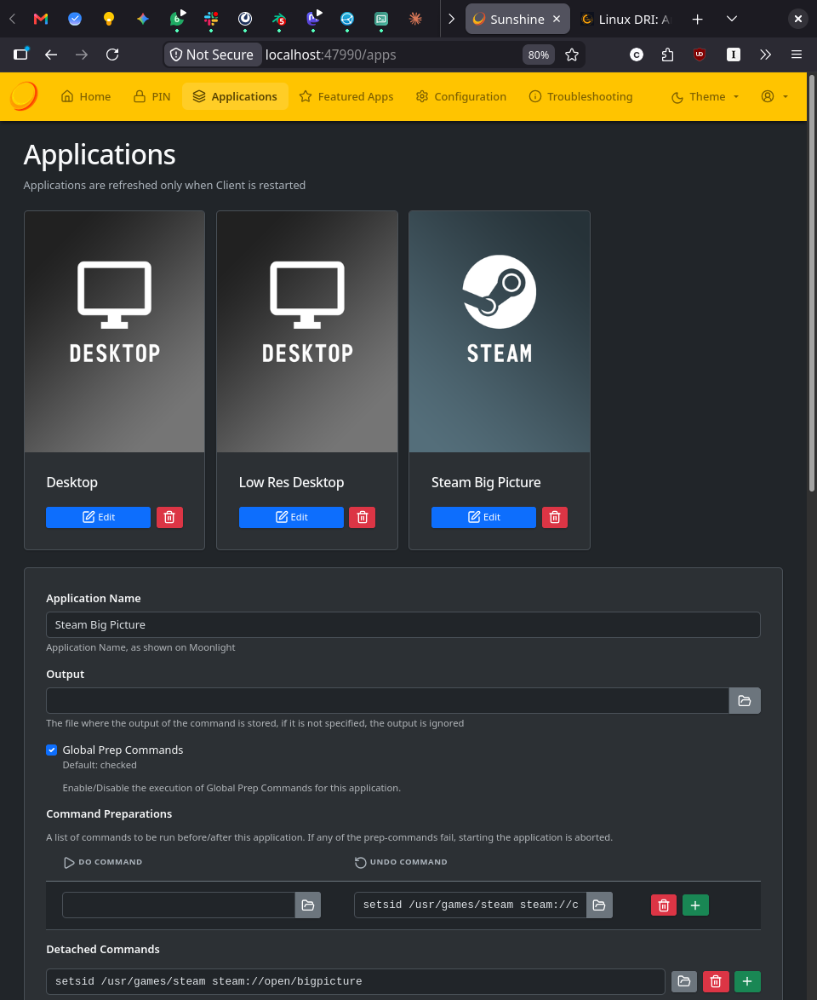

Title: jellygin-moonlight-raspi
Description:
Tags:
--

Goal:

- a low powered, low consumption machine to stream games from my workstation and play video from a jellyfin server.
- When powered, I can grab my game controller, starts steam in big picture mode and play, all without needed to grab a keyboard to log in.

Techs:

- Debian trixie, because that's what I run everywhere by default
- Raspberry Pi 4 I already owned
- Game streaming with [moonlight-qt](TODO: add link here) TODO: short description of moonlight
- Video streaming with [jellyfin-mpv-shim](TODO: add link here) TODO: short description of jellyfin-mpv-shim
- [Cage](TODO: add link here) wayland display manager taylored for this kind of kiosk setup. TODO: explain briefly what a kiosk is

Why Cage ? Both moonlight and video can run [without a display server](https://linuxvox.com/blog/linux-dri/) linux xorg or wayland. But they then take full ownership of the GPU memory and can't run both at the same time. Cage is used here to help sharing the GPU. I chose cage because it's dead simple and purposely made to run applications in full screen. It will always display moonlight, but when the jellyfin shim starts a video, it'll open an [mpv](TODO: add link here) that will take the full screen until it is stopped.

Note about audio:

- no [pulseaudio](TODO: add link here) or [pipewire](TODO: add link here), [alsa](TODO: add link here) is enough for now, as no application are playing sound at the same time, so there is no need for audio mixing. Keep thing simple until it's needed.
- use the Raspberry Pi audio output jack, not HDMI:
  - It's the default Raspberry Pi output, so no need for extra configuration
  - I didn't notice video / latency yet (that can happen when audio and video are not transported by the same HDMI signal)
  - I've noticed in a previous setup weird audio artifacts as if a noise gate was really slow to open with audio routed through the video projector HDMI input. Not sure if the problem is the projector or the super cheap loudspeakers that play audio, so I want to try direct jack output from the Pi for a while

## Sunshine on the workstation

- Download the .deb (there is no debian repo yet)
- Install
- Allow low-latency desktop video capture 
- Ensure the user has access to inputs like the gamepad (that should already be the case)
- Enable sunshine at startup. It consumes almost no CPU/memory when not actively streaming
- Ensure the steam binary is findable by sunshine. 

```
wget https://github.com/LizardByte/Sunshine/releases/download/v2026.516.143833/sunshine-debian-trixie-amd64.deb
sudo apt install ./sunsine-debian-trixie-amd64.deb
# 1. Allow Sunshine to access the KMS/DRM graphics subsystem for low-latency capture
sudo setcap cap_sys_admin+p $(readlink -f $(which sunshine))
# 2. Grant gamepad and mouse input capabilities to your user group
    sudo usermod -aG input $USER
# Reboot your host machine to apply these system-level group privileges!
    systemctl --user enable --now app-dev.lizardbyte.app.Sunshine.service
```

Sunshine is ran by systemd and I don't think the default systemd service file shipped with the debian package passes the PATH environment variable, which means that we need to give the full path to the applications sunshine is running.

- Open the [Sunshine configuration panel](https://localhost:47990)
- Go to Applications > Steam Big Picture > Edit
- Set the full path to steam in the `Undo command` and `Detached commands` field. `setsid steam` becomes `setsid /usr/games/steam`.
- Save the configuration



## Raspberry pi preparation

- Installed the [Raspeberry PI OS Lite](https://www.raspberrypi.com/software/operating-systems/) version to start from a mininal instal
- Had to invoke [rpi-imager](TODO: add link here) is a [slightly unusual way](https://charlesfleche.net/rpi-imager-on-wayland/) to run it as root through xwayland on my [sway](TODO: insert link to sway compositor here) desktop.


Allowing more unified memory to be allocated to the GPU is recommanded by the [moonlight documentation](https://github.com/moonlight-stream/moonlight-docs/wiki/Fixing-Hardware-Decoding-Problems#raspberry-pi)

```bash
echo "gpu_mem=128" | sudo tee -a /boot/config.txt
sudo reboot
```

## Moonlight install

Simple, just run the [official script](https://github.com/moonlight-stream/moonlight-docs/wiki/Installing-Moonlight-Qt-on-Raspberry-Pi-4)

```bash
curl -1sLf \
  'https://dl.cloudsmith.io/public/moonlight-game-streaming/moonlight-qt/setup.deb.sh' \
  | \
  distro=raspbian codename=$(lsb_release -cs) sudo -E bash
sudo apt install moonlight-qt
```

## jellyfin-mpv-shim 

### install

- Install the video player [mpv](TODO: link to the mpv media player) from the debian 
- no debian package in the repository for jellyfin-mpv-shim
- install it straight from the [python package index](TODO: link to the jellyfin-mpv-shim pypi package page)
- [pipx](TODO: link to pipx) to fetch the package and put the exectuable in the `PATH`


```bash
sudo apt install pipx mpv
pipx install jellyfin-mpv-shim
pipx inject jellyfin-mpv-shim pillow  # to avoid a warning in the logs
pipx ensurepath
jellyfin-mpv-shim  # Run once to initialize configuration
```


### mpv configuration

- The raspberry pi 4 needs to tweaked for video playback performance,. mainly to force GPU decoding as the CPU is not powerful enough for smooth playback.
- Most important parameters are `profile=fast` and `vo=gpu-next` to allow `hwdec=v4l2m2m-copy`
- Rest is fine tuning to allow even faster decoding

jellyfin-mpv-shim has it's own mpv configuration. During performance testing when running mpv on its own, I find that confusing vs using mpv's default config. To make sure mpv always run with the same config, I just create a symbolic link:

```bash
mkdir -p ~/.config/mpv
ln -s ~/.config/jellyfin-mpv-shim/mpv.conf ~/.config/mpv/mpv.conf
```

The `mpv.conf` is:

```ini
# --- Hardware decoding ---
hwdec=v4l2m2m-copy
vd-lavc-dr=no

# --- Video output ---
vo=gpu-next
gpu-api=opengl

# --- Fast decoding profile ---
profile=fast

# --- Scaling (cheap, since Pi 4 GPU is weak) ---
scale=bilinear
dscale=bilinear
cscale=bilinear
dither=no
correct-downscaling=no
linear-downscaling=no
sigmoid-upscaling=no

# --- Reduce OSD/OSC overhead ---
osc=no
osd-level=1

# --- Avoid unnecessary color/HDR processing ---
hdr-compute-peak=no
target-colorspace-hint=no

# --- Audio ---
audio-channels=stereo
# Preconfiguring pipewire and pulse just in case I need them one day
# and don't spend an hour not understanding why audio is always alsa
ao=pipewire,pulse,alsa

# --- Cache / smoother seeking on network shares (e.g. Jellyfin) ---
cache=yes
demuxer-max-bytes=64MiB
demuxer-readahead-secs=10

# --- Framedrop on overload rather than desync ---
framedrop=vo

# --- Avoid heavy subtitle rendering ---
sub-font-size=32
```

### Cage

- install cage
- make a script to run moonlight the jellyfin shim
- enable autologin so the machine boots straight into moonlight

First, the script to run that will run moonlight and the jellyfin shim. Notes:
- uses full path executables as to make it safe run from systemd  
- ensure we run moonlight in wayland directly and not xwayland accidentaly

I save it in `/home/charles/statup-apps.sh`

```bash
#!/usr/bin/env bash
export QT_QPA_PLATFORM=wayland
exec /usr/bin/moonlight-qt &
exec /home/charles/.local/bin/jellyfin-mpv-shim
```

Then systemd service to autologin the `charles` user into cage. Saved as `/etc/systemd/system/display-manager.service`. This service file has been simplified from the service file suggested on [cage's documentation](https://github.com/cage-kiosk/cage/wiki/Starting-Cage-on-boot-with-systemd/d1f06017c22413058524f616004f03ab1af0328a).

```systemd
# This is a system unit for launching Cage with auto-login as the
# user configured here. For this to work, wlroots must be built
# with systemd logind support.

[Unit]
Description=Cage Wayland compositor
# Make sure we are started after logins are permitted. If Plymouth is
# used, we want to start when it is on its way out.
After=systemd-user-sessions.service plymouth-quit-wait.service
# Since we are part of the graphical session, make sure we are started
# before it is complete.
Before=graphical.target
# On systems without virtual consoles, do not start.
ConditionPathExists=/dev/tty0
# D-Bus is necessary for contacting logind, which is required.
Wants=dbus.socket systemd-logind.service
After=dbus.socket systemd-logind.service
# Replace any (a)getty that may have spawned, since we log in
# automatically.
Conflicts=getty@tty1.service
After=getty@tty1.service

[Service]
Type=simple
#ExecStart=/usr/bin/cage
ExecStart=/usr/bin/cage -sd -- /home/charles/startup-apps.sh
#ExecStartPost=+sh -c exec chvt 1
Restart=always
User=charles
# Log this user with utmp, letting it show up with commands 'w' and
# 'who'. This is needed since we replace (a)getty.
UtmpIdentifier=tty1
UtmpMode=user
# A virtual terminal is needed.
TTYPath=/dev/tty1
TTYReset=yes
TTYVHangup=yes
TTYVTDisallocate=yes
# Fail to start if not controlling the virtual terminal.
StandardInput=tty-fail

# Set up a full (custom) user session for the user, required by Cage.
PAMName=cage

[Install]
WantedBy=graphical.target
```

Last thing, we actually install cage, disable default services that could conflict and enable cage to start at boot.

```bash
# Install cage
sudo apt install cage

# Stop the standard console login from blocking that same TTY
sudo systemctl disable getty@tty1.service

# Tell systemd to default to the graphical target
sudo systemctl set-default graphical.target
```

# Ready to stream

And that's it. After reboot, the raspberry pi should boot into moonligh and wait for jellyshin playback to be requested by another player on the LAN, like a smartphone jellyfin client or the web frontend.

